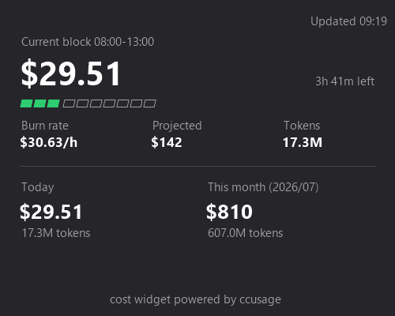

# Token Cost Widget

A Windows 11 **Widgets Board** (Win+W) widget that shows your coding agent token usage and costs, via ccusage's `daily` / `monthly` / `blocks` commands.



## Acknowledgements

This app is built on top of [ccusage](https://github.com/ccusage/ccusage) (MIT License). All log parsing and cost aggregation is done by the official ccusage native binary — this app is merely a thin presentation layer on top of it. Many thanks to the ccusage project for building and maintaining such a great tool.

## What is this?

When you're using a coding agent CLI, you inevitably start wondering: how much is left in the current 5-hour block? How much have I spent today, or this month? This widget puts those answers **one Win+W away**.

- **Current 5-hour block**: cost, remaining time, progress bar, burn rate ($/h), and projected cost at the end of the block
- **Today**: cost and token count
- **This month**: total cost, token count, and per-model cost breakdown
- The amount of information shown adapts to the widget size (small / medium / large)
- Auto-refreshes every 60 seconds while the Widgets Board is open

### Privacy

The only data source is your local coding agent logs. Aggregation happens locally via the bundled ccusage binary — **nothing is sent anywhere**.

## Installation

Requirements: Windows 11 (22H2 / build 22621 or later)

Install from the **Microsoft Store**: no developer mode, no manual steps — the Store handles signing and updates. After installing, open the Widgets Board with **Win+W**, click **+** (Add widgets), and add **Token Cost Widget**.

To run from source instead, see [Development](#development) below.

### Uninstall

Remove it from Settings > Apps, or right-click the app in the Start menu and choose Uninstall.

### Troubleshooting

| Symptom | What to do |
|---|---|
| Every value shows "-" | Check that your coding agent's logs exist. There is no data right after you start using it |
| Costs are missing | Use your coding agent in a terminal once, wait a bit, and reopen the board (pricing data may need to be cached) |
| The card shows an error | Follow the message on the card. Logs are at `%LOCALAPPDATA%\Packages\CostWidget_*\LocalCache\Local\CostWidget\provider.log` |
| Nothing shows right after adding | Close and reopen the Widgets Board |

## Development

### Prerequisites

- Windows 11 (22H2 or later) with Developer Mode enabled
- [mise](https://mise.jdx.dev/) — `mise install` installs the .NET 8 SDK

### Build and register locally

```powershell
.\scripts\install.ps1
```

This single script fetches the ccusage native binary, runs `dotnet publish`, and registers the loose layout with `Add-AppxPackage -Register`. No Visual Studio required. To unregister, run `.\scripts\uninstall.ps1`.

### Layout

```
src/CostWidgetProvider/      C# widget provider (out-of-proc COM server)
  ├─ Program.cs              COM class factory registration and process lifetime
  ├─ WidgetProvider.cs       IWidgetProvider implementation (60s auto-refresh)
  ├─ UsageService.cs         Runs the bundled ccusage and aggregates JSON
  ├─ Templates/              Adaptive Cards templates (small/full/large)
  ├─ Tools/                  Bundled ccusage.exe (fetched at build time, not in git)
  └─ AppxManifest.xml        MSIX manifest (widget / COM registration)
scripts/
  ├─ install.ps1             Build + loose registration (for development)
  ├─ uninstall.ps1           Unregister
  ├─ fetch-ccusage.ps1       Fetch the ccusage native binary
  ├─ pack.ps1                Build the unsigned, Store-ready .msix
  └─ generate-assets.ps1     Regenerate icon / screenshot PNGs
.github/workflows/
  ├─ ci.yml                    Build + format check on push/PR
  ├─ check-ccusage-update.yml  Daily check for a newer ccusage; bumps versions and tags
  └─ store-package.yml         Build the Store .msix and upload it as an artifact on v* tags
ccusage.version              Bundled ccusage version (single source of truth)
```

Architecture notes:

- The Widgets Board activates the provider exe via COM and receives Adaptive Cards (JSON) to render
- The .NET and Windows App SDK runtimes are bundled (self-contained), so there is no framework package dependency

On every refresh the provider runs the bundled ccusage binary three times in parallel, one command per card section:

| Command | Feeds |
|---|---|
| `ccusage blocks --json --active` | Current 5-hour block (cost, remaining time, burn rate, projection) |
| `ccusage daily --json --since <today>` | Today's cost and tokens |
| `ccusage monthly --json --since <1st of month>` | Monthly totals and per-model breakdown |

`--json` keeps the widget independent of ccusage's table formatting, and `--since` limits aggregation to the relevant range. `ccusage --version` is run once to show the bundled version in the widget footer.

Pricing is looked up online (no `--offline` flag) because ccusage's offline pricing table is baked into the binary at release time and can lag behind newly released models, silently showing $0 cost for them. To keep this from hitting the network on every render, results are cached for `CacheTtl` (3 minutes, see `UsageService.cs`), and the 60-second auto-refresh timer in `WidgetProvider.cs` reuses that cache instead of forcing a fresh fetch; only the manual refresh action forces one.

### Lint / Format

- Code style is defined in [.editorconfig](.editorconfig). Format with `mise exec -- dotnet format src/CostWidgetProvider/CostWidgetProvider.csproj`
- Builds run the .NET analyzers (`latest-recommended`) and code-style checks; CI verifies with `dotnet format --verify-no-changes`

### Versioning and releases

- The app follows **semantic versioning** (tag `v0.1.0` → package identity version `0.1.0.0`)
- The bundled ccusage version is pinned in [ccusage.version](ccusage.version), independent of the app version. Bumping it warrants at least a PATCH release
- The bundled version is also shown at runtime in the widget footer
- **check-ccusage-update.yml** checks the npm registry daily; if a newer `@ccusage/ccusage-win32-x64` is found, it bumps `ccusage.version` and the app's patch version, commits, and pushes a new tag. That triggers **store-package.yml**, which builds the msix and opens an issue as a reminder — actually uploading the package to Partner Center stays a manual step

### Publishing to the Store

Distribution is via the Microsoft Store; GitHub hosts source only. The Store package identity is provided to CI through three repository variables (Settings > Secrets and variables > Actions > Variables), taken from Partner Center > Product identity:

| Variable | Example |
|---|---|
| `STORE_IDENTITY_NAME` | `moritalous.TokenCostWidget` |
| `STORE_IDENTITY_PUBLISHER` | `CN=XXXXXXXX-XXXX-XXXX-XXXX-XXXXXXXXXXXX` |
| `STORE_PUBLISHER_DISPLAY_NAME` | `moritalous` |

Pushing a `v*` tag (or running the **Store package** workflow manually) builds an unsigned, Store-ready `.msix` and uploads it as a workflow artifact. Download it and upload it in Partner Center — the Store re-signs it during certification, so no code-signing certificate is needed.

## Disclaimer

- This is a personal project. It is not an official product of the ccusage project
- Displayed costs are **estimates** computed by ccusage from local logs and may differ from your actual bill

## License

This project is licensed under the [MIT License](LICENSE).

The bundled ccusage binary ([@ccusage/ccusage-win32-x64](https://www.npmjs.com/package/@ccusage/ccusage-win32-x64)) is also MIT-licensed by the [ccusage](https://github.com/ccusage/ccusage) project. Its license text is not in this repository; it is downloaded together with the binary at build time and included in the distributed package as `package\Tools\LICENSE-ccusage.txt`.
